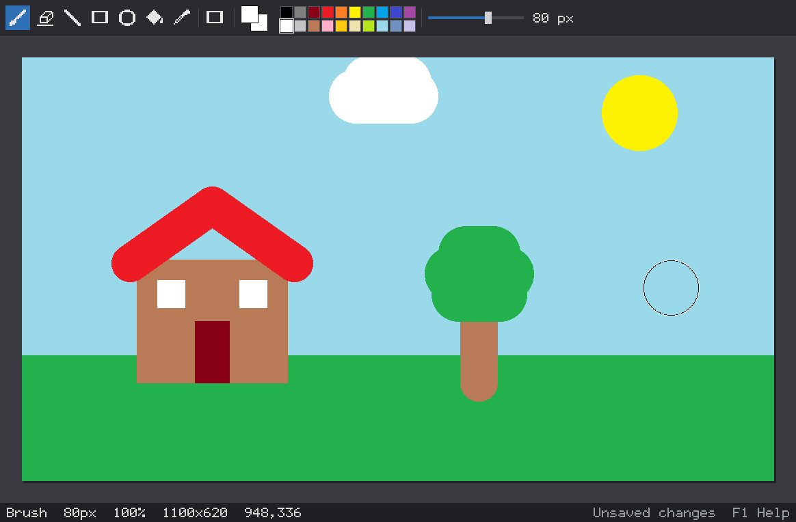
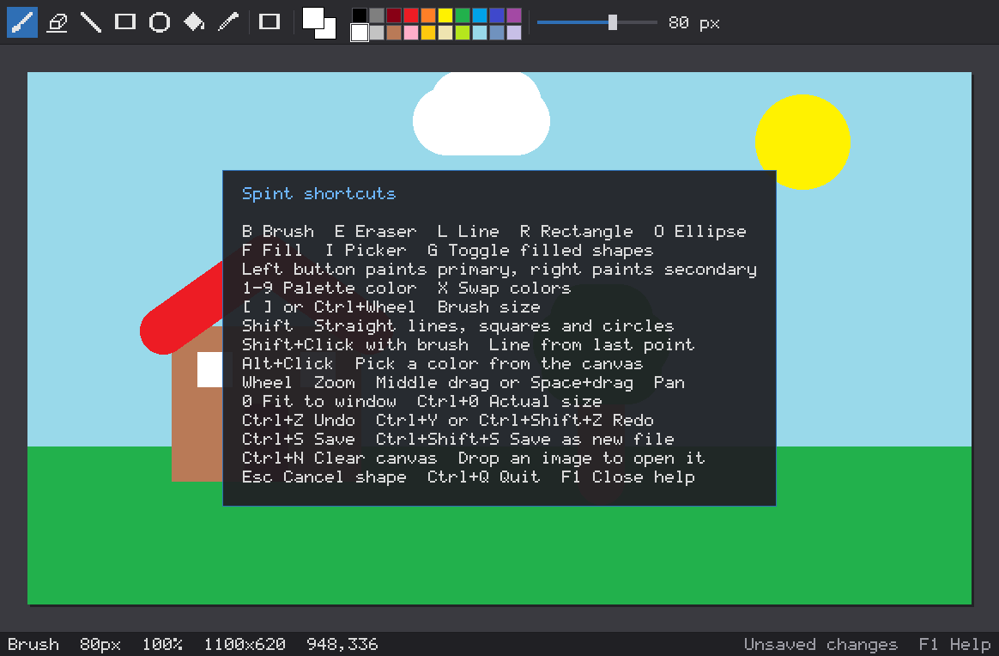

# Spint

A small, fast paint program written in C with SDL2.

Spint keeps the whole image in a plain pixel buffer in memory, only sends the pixels that changed to the GPU, and does no work at all while you are not touching it. It starts instantly, stays responsive on 4K canvases, and builds into a single small binary.



## Features

- Brush, eraser, line, rectangle, ellipse, bucket fill and color picker
- Outline or filled shapes, with Shift for straight lines, squares and circles
- Primary and secondary colors on the left and right mouse buttons
- A 20 color palette, brush sizes from 1 to 200 px, and a live brush outline
- Undo and redo that store only the changed parts of the image
- Open PNG, JPG, BMP, TGA and GIF. Save PNG, JPG, BMP and TGA
- Saving runs in the background, so the window never freezes
- Resizable window, zoom from 2% to 6400%, panning and a pixel grid at high zoom
- Drop an image onto the window to open it
- Asks for a second confirmation before quitting or opening over unsaved work

## Build

Spint needs a C11 compiler, `make`, `pkg-config` and SDL2. PNG and JPG support comes from the [stb](https://github.com/nothings/stb) headers included in `third_party`, so nothing else is needed.

Debian and Ubuntu:

```bash
sudo apt install build-essential pkg-config libsdl2-dev
```

Fedora:

```bash
sudo dnf install gcc make pkgconf-pkg-config SDL2-devel
```

Arch:

```bash
sudo pacman -S base-devel sdl2
```

macOS:

```bash
brew install sdl2 pkg-config
```

Then:

```bash
make
./spint
```

Optional: `sudo make install` copies `spint` to `/usr/local/bin`.

## Usage

- `spint` starts a new 1280x720 canvas.
- `spint drawing.png` opens `drawing.png`, or creates it on the first save if it does not exist.
- `spint --size 1920x1080 new.png` starts a 1920x1080 canvas that saves to `new.png`.

Ctrl+S saves to the file you opened. A new canvas without a file name is saved as `spint-YYYYMMDD-HHMMSS.png` in the current folder. The file extension picks the format.

## Controls

Press F1 inside Spint to see this list at any time.



| Key | Action |
| --- | --- |
| B, E, L, R, O, F, I | Brush, Eraser, Line, Rectangle, Ellipse, Fill, Picker |
| G | Toggle filled shapes |
| Left / right mouse button | Paint with the primary / secondary color |
| 1 to 9 | Pick a palette color |
| X | Swap primary and secondary colors |
| [ and ], Ctrl+Wheel | Brush size |
| Shift while dragging | Straight lines at 45 degree steps, squares, circles |
| Shift+Click with the brush | Straight line from the end of the last stroke |
| Alt+Click | Pick a color from the canvas |
| Wheel, + and - | Zoom |
| Middle drag, Space+drag | Pan |
| 0 / Ctrl+0 | Fit to window / actual size |
| Ctrl+Z | Undo |
| Ctrl+Y, Ctrl+Shift+Z | Redo |
| Ctrl+S / Ctrl+Shift+S | Save / save as a new timestamped file |
| Ctrl+N | Clear the canvas (can be undone) |
| Esc | Cancel the shape being drawn |
| Ctrl+Q | Quit |

The eraser paints with the secondary color, which is white by default.

## How it works

- `src/canvas.c` holds the image as 32-bit pixels and tracks the rectangle that changed since the last frame. Only that rectangle is uploaded to the GPU texture.
- `src/draw.c` draws everything as horizontal spans. A brush stroke between two mouse positions is drawn as one solid capsule shape, so each pixel is written once instead of stamping a circle per pixel. Bucket fill is a scanline fill with its own stack, so large areas never overflow the call stack.
- `src/history.c` splits the canvas into 64x64 tiles. Before a tile is changed for the first time in an action, it is copied. Undo and redo just swap those tiles back, so the cost depends on what you changed and not on the canvas size. History is capped at 256 MB and drops the oldest steps first.
- `src/main.c` waits for events instead of looping, and redraws only when something changed.

## Tests

- `make test` checks brush shapes, rectangles and ellipses, flood fill, undo and redo, and saving and loading PNG, BMP and TGA files.
- `make bench` prints timings on a 3840x2160 canvas.
- `make debug` builds `spint-debug` with AddressSanitizer and UndefinedBehaviorSanitizer.

## Third party code

The stb headers in `third_party` are public domain (or MIT, at your choice), as stated inside each file.
